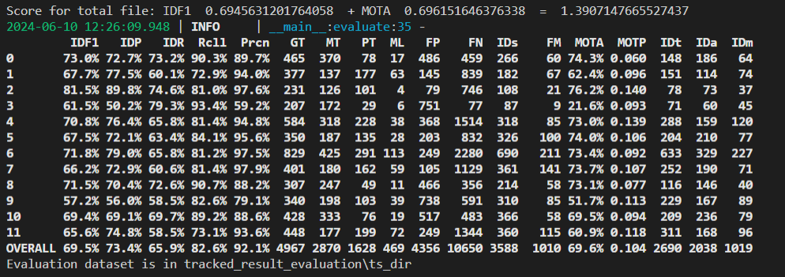

# Multi-Camera Vehicle Tracking Based on ReID and Mapped Mahalanobis Distance

## Introduction

此專題提出一個結合車輛外觀辨識與行車路徑的跨相機多目標車輛追蹤方法。方法引用 BoT-SORT baseline 框架，過程同樣使用兩階段的追蹤匹配。於第一階段中，會同時考慮兩幀畫面中車輛的外觀與行車路徑的異同以進行匹配。不同於 BoT-SORT 以路徑為主，外觀為輔，僅設置外觀遮罩。本框架於兩者間皆設置遮罩以供開發者及使用者可以根據其資料特性，調整適當的遮罩參數與條件，以取得較為準確的追蹤效果。另外，為能更靈活的運用特徵，即考慮到資料取樣條件的不同，針對行車路徑距離的計算方式，此框架參考 UCMCTrack 使用投影至地面的Mahalanobis Distance作為依據的作法，而非原先容易受相機狀態與取樣頻率影響而失去追蹤的 IoU (Intersection over Union)，如此一來，便能避免逐幀進行相機補償所需的大量計算資源和時間，提升推理和追蹤的效率。

## Table of Contents

- [Introduction](#introduction)
- [Usage](#usage)
- [Features](#features)
- [Installation](#installation)

## Usage 
提供Colab執行範例於`AI_CUP.ipynb`

## Features

- 結合車輛外觀辨識與行車路徑的跨相機追蹤
- 自定義外觀和行車路徑遮罩
- 使用投影至地面的 Mahalanobis Distance 進行行車路徑計算
- 減少相機補償所需的計算資源

## Data Preparation

Download the AI_CUP dataset, the original dataset structure is:
```python
├── train
│   ├── images
│   │   ├── 0902_150000_151900 (Timestamp: Date_StartTime_EndTime)
│   │   │  ├── 0_00001.jpg (CamID_FrameNum)
│   │   │  ├── 0_00002.jpg
│   │   │  ├── ...
│   │   │  ├── 1_00001.jpg (CamID_FrameNum)
│   │   │  ├── 1_00002.jpg
│   │   │  ├── ...
│   │   │  ├── 7_00001.jpg (CamID_FrameNum)
│   │   │  ├── 7_00002.jpg
│   │   ├── 0902_190000_191900 (Timestamp: Date_StartTime_EndTime)
│   │   │  ├── 0_00001.jpg (CamID_FrameNum)
│   │   │  ├── 0_00002.jpg
│   │   │  ├── ...
│   │   │  ├── 1_00001.jpg (CamID_FrameNum)
│   │   │  ├── 1_00002.jpg
│   │   │  ├── ...
│   │   │  ├── 7_00001.jpg (CamID_FrameNum)
│   │   │  ├── 7_00002.jpg
│   │   ├── ...
│   └── labels
│   │   ├── 0902_150000_151900 (Timestamp: Date_StartTime_EndTime)
│   │   │  ├── 0_00001.txt (CamID_FrameNum)
│   │   │  ├── 0_00002.txt
│   │   │  ├── ...
│   │   │  ├── 1_00001.txt (CamID_FrameNum)
│   │   │  ├── 1_00002.txt
│   │   │  ├── ...
│   │   │  ├── 7_00001.txt (CamID_FrameNum)
│   │   │  ├── 7_00002.txt
│   │   ├── 0902_190000_191900 (Timestamp: Date_StartTime_EndTime)
│   │   │  ├── 0_00001.txt (CamID_FrameNum)
│   │   │  ├── 0_00002.txt
│   │   │  ├── ...
│   │   │  ├── 1_00001.txt (CamID_FrameNum)
│   │   │  ├── 1_00002.txt
│   │   │  ├── ...
│   │   │  ├── 7_00001.txt (CamID_FrameNum)
│   │   │  ├── 7_00002.txt
│   │   ├── ...
--------------------------------------------------
├── test
│   ├── images
│   │   ├── 0902_150000_151900 (Timestamp: Date_StartTime_EndTime)
│   │   │  ├── 0_00001.jpg (CamID_FrameNum)
│   │   │  ├── 0_00002.jpg
│   │   │  ├── ...
│   │   │  ├── 1_00001.jpg (CamID_FrameNum)
│   │   │  ├── 1_00002.jpg
│   │   │  ├── ...
│   │   │  ├── 7_00001.jpg (CamID_FrameNum)
│   │   │  ├── 7_00002.jpg
│   │   ├── 0902_190000_191900 (Timestamp: Date_StartTime_EndTime)
│   │   │  ├── 0_00001.jpg (CamID_FrameNum)
│   │   │  ├── 0_00002.jpg
│   │   │  ├── ...
│   │   │  ├── 1_00001.jpg (CamID_FrameNum)
│   │   │  ├── 1_00002.jpg
│   │   │  ├── ...
│   │   │  ├── 7_00001.jpg (CamID_FrameNum)
│   │   │  ├── 7_00002.jpg
│   │   ├── ...
```

### Ground Truth Format  
Each image corresponds to a text file, an example is provided below:

>[!WARNING] 
> **The coordinates and dimensions of the Ground Truth data are normalized**

class|center_x|center_y|width   |height|track_ID|
-----|--------|--------|--------|------|--------|
0    |0.704687|0.367592|0.032291|0.1   |1       |

```python
# image_name1.txt

0 0.704687 0.367592 0.032291 0.1 1
0 0.704166 0.403703 0.030208 0.087037 2
0 0.929166 0.710185 0.051041 0.162962 3
0 0.934114 0.750925 0.084895 0.162962 4
0 0.780208 0.273148 0.023958 0.062962 5
0 0.780989 0.246296 0.022395 0.066666 6
```
## Environment Installation
- Python3.7 
- torch 1.11.0+cu113 and torchvision==0.12.0 
- install MSVC v143 - VS 2022 C++ x64/x86 build tools
- setuo with conda environment

### Setup with Conda
**Step 1.** Create Conda environment and install pytorch.
```shell
conda create -n botsort python=3.7
conda activate botsort
```
**Step 2.** Install torch and matched torchvision from [pytorch.org](https://pytorch.org/get-started/locally/).<br>
The code was tested using torch 1.11.0+cu113 and torchvision==0.12.0 

**Step 3.** Fork this Repository and clone your Repository to your device

**Step 4.** **Install numpy first!!**
```shell
pip install numpy
```

**Step 5.** Install `requirements.txt`
```shell
pip install -r requirements.txt
```

**Step 6.** Install [pycocotools](https://github.com/cocodataset/cocoapi).
```shell
pip install cython; pip3 install 'git+https://github.com/cocodataset/cocoapi.git#subdirectory=PythonAPI'
```

**Step 7.** Others
```shell
# Cython-bbox
pip install cython_bbox

# faiss cpu / gpu
pip install faiss-cpu
pip install faiss-gpu
```


## Training Installation
The code was tested on Windows10
To install the project, follow these steps:

1. Clone the repository:
   ```bash
   git clone https://github.com/chenp6/aicup-multi-camera-vehicle-tracking.git 

2. 訓練基於ReID的車輛外觀提取模型  
(1) 準備ReID訓練資料集
   ```bash
   cd <aicup-multi-camera-vehicle-tracking> 
   rem For AICUP  
   python fast_reid/datasets/generate_AICUP_patches.py --data_path datasets/AI_CUP_MCMOT_dataset/train  

(2) 設置訓練參數與資料擴增方法   
   a. 使用此project提供之配置 : `fast_reid\configs\AICUP\VehicleID_with_data_augmentation.yml`  
   b. 可直接變更配置檔以自行重新設置參數 : 
   配置檔位於 `fast_reid\configs\AICUP\VehicleID_with_data_augmentation_custom.yml`  
      (`fast_reid/fast_reid/config/defaults.py`內有提供各參數與其調整方法)  

(3) 訓練ReID模型  
   ```bash 
   cd <aicup-multi-camera-vehicle-tracking>   
   python fast_reid/tools/train_net.py --config-file fast_reid/configs/AICUP/<參數配置檔名稱> MODEL.DEVICE "cuda:0"   
   ```

(4) 取得訓練完成之模型   
   模型輸出路徑由配置檔中的`OUTPUT_DIR: <模型欲輸出路徑>`設定  


3. 訓練YOLO模型  
(1) 準備 YOLOv7 資料集
   ```bash 
   cd <aicup-multi-camera-vehicle-tracking>   
   python yolov7/tools/AICUP_to_YOLOv7.py --AICUP_dir datasets/AI_CUP_MCMOT_dataset/train --YOLOv7_dir datasets/AI_CUP_MCMOT_dataset/yolo 
   ```
  執行後即可得到 train/valid/test 訓練資料集

(2) 下載預訓練權重  
   本次專案採用的預訓練權重為 `yolov7-e6e` 權重，可以從 [yolov7 github](https://github.com/WongKinYiu/yolov7) 下載。
   將下載之權重放置於 ` \aicup-multi-camera-vehicle-tracking\pretrained` 資料夾底下

(3) 微調模型
   可以自行調整 batch-size 及 epochs 等超參數設置
  ```bash
   cd <aicup-multi-camera-vehicle-tracking>  
   python yolov7/train_aux.py ^
      --device 0  ^
      --batch-size 8  ^
      --epochs 50  ^
      --data yolov7/data/AICUP.yaml  ^
      --img 1280 1280 --cfg yolov7/cfg/training/yolov7-w6-AICUP.yaml  ^
      --weights 'pretrained/yolov7-e6e.pt'  ^
      --name yolov7-weight ^
      --hyp data/hyp.scratch.custom.yaml ^
   ```
   微調後的權重和訓練結果可以在 `.\runs\train\yolov7-weight`  下找到


4. 調整追蹤模型  
(1) 將訓練完成的ReID模型與YOLO模型放入`\trained_model`資料夾中    
(2) 將ground truth bbox文字檔案放入`\tracked_result_evaluation\gt_dir`資料夾中   
(3) 將追蹤使用的ReID模型參數設定(.yml)放入`fast_reid/configs/AICUP/`中  
(4) 利用UCMCTrack提供的Estimation tool 建立各鏡頭的相機參數檔案並放入`camera_para_files`中  
    檔案命名方式須符合‵cam_para_<CamID>.txt`  
    [註] 預設檔案為AICUP資料集之八鏡頭的相機參數，若使用其他資料集則根據鏡頭數覆蓋與新增txt
   ```bash
   ├── cam_para_files
   │   ├── cam_para_0.txt
   │   ├── cam_para_1.txt
   │   ├── cam_para_2.txt
   │   ├── cam_para_3.txt
   │   ├── cam_para_4.txt
   │   ├── cam_para_5.txt
   │   ├── cam_para_6.txt
   │   ├── cam_para_7.txt   
   │   │   ...   
   ```
(5) 參考`track_all_timestamps_example_template.bat`建立追蹤模型執行之bash檔案     
   [註] 提供`track_all_timestamps_example_train.bat`與 `track_all_timestamps_example_test.bat` 分別為追蹤AICUP賽事資料集訓練與測試dataset的模型執行bash檔案  
(6) 根據資料集特性調整MMD與ReID的遮罩與閾值參數 (撰寫於bat中) 
``` bash
    python tools/mc_demo_yolov7.py ^
        --weights pretrained/%YOLO_MODEL% ^
        --source "datasets/AI_CUP_MCMOT_dataset/test/images/%%s" ^
        --device "0" --name "%%s" ^
        --fuse-score --agnostic-nms ^
        --with-reid --fast-reid-config "fast_reid/configs/AICUP/<ReID模型參數設定yml檔>" ^
        --fast-reid-weights "%REID_WEIGHT_DIR%" ^
        --MMD_max <MMD正規化最大值之原始數值> ^
        --MMD_mask  <MMD遮罩(用來遮ReID，較為寬鬆)> ^
        --MMD_thresh <MMD閾值(較為嚴格)> ^
        --ReID_mask <ReID遮罩(用來遮MMD，較為寬鬆)> ^
        --ReID_thresh <ReID閾值(較為嚴格)>
```  

(7) 執行追蹤模型程式  
   ```bash
   cd <aicup-multi-camera-vehicle-tracking> 
   <追蹤模型執行之bat檔案路徑>
   ```
(8) 取得結果  
   a. 追蹤結果之畫面儲存於`\tracked_result`  
   b. 追蹤結果之bbox文字檔儲存於`\tracked_result_evaluation\ts_dir`   
   c. 評估結果呈現於終端機畫面中   
   


## Acknowledgement

A large part of the codes, ideas and results are borrowed from
- [AICUP_Baseline_BoT-SORT](https://github.com/ricky-696/AICUP_Baseline_BoT-SORT/)
- [BoT-SORT](https://github.com/NirAharon/BoT-SORT)
- [ByteTrack](https://github.com/ifzhang/ByteTrack)
- [StrongSORT](https://github.com/dyhBUPT/StrongSORT)
- [FastReID](https://github.com/JDAI-CV/fast-reid)
- [YOLOX](https://github.com/Megvii-BaseDetection/YOLOX)
- [YOLOv7](https://github.com/wongkinyiu/yolov7)
- [UCMCTrack](https://github.com/corfyi/UCMCTrack)   
Thanks for their excellent work!
